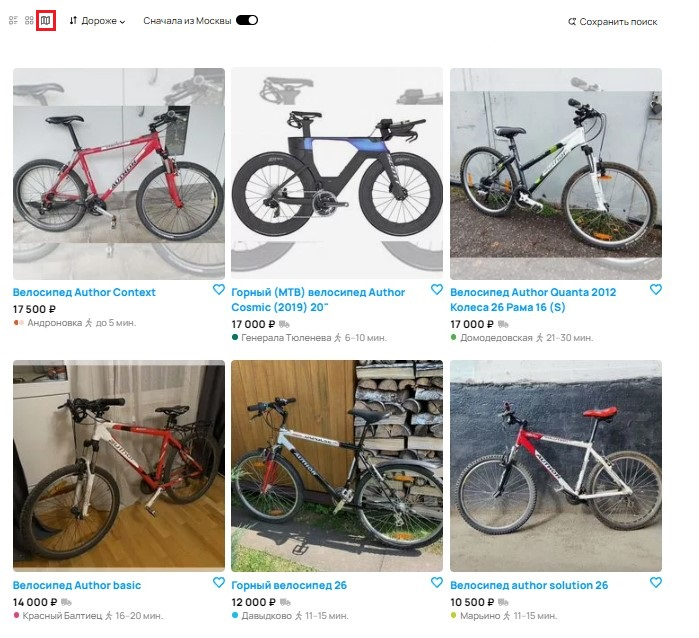

# Баги высокого приоритета (High)
1. ### **Некорректная работа сортировки по убыванию цены**
* **Описание**: При выборе сортировки «Дороже» объявления не упорядочиваются по убыванию цены. Вместо этого они отображаются в случайном порядке.
* **Влияние**: Нарушает ключевой функционал поиска, затрудняя пользователям просмотр наиболее дорогих предложений.  

2. ### **Некорректная работа фильтра «Сначала из Москвы»**
* **Описание**: При выборе сортировки «Сначала из Москвы» выше располагаются объявления из других городов, вместо того чтобы показывать в приоритете московские объявления.
* **Влияние**: Фильтр не выполняет свою основную задачу, затрудняя пользователям поиск нужных объявлений.  

3. ### **Некорректное отображение объявлений при выборе режима «Карта»**
* **Описание**: При выборе параметра отображения «Карта» объявления отображаться в виде плитки, а карта не загружается.
* **Влияние**: Нарушает функционал страницы, а точнее выдачу объявлений в неверном виде, что снижает удобство пользования сайта.  

4. ### **Некорректная работа фильтра по бренду**
* **Описание**: При выборе фильтра «Author» в списке объявлений отображаются товары других брендов, что нарушает работу фильтрации.
* **Влияние**: Некорректная работа фильтра затрудняет пользователям поиск нужных товаров, снижая удобство использования сайта.  

# Баги среднего приоритета (Medium)
5. ### **Некорректное отображение количества страниц в пагинации**
* **Описание**: На странице указано, что доступно 100 страниц с объявлениями, хотя должно быть 6 страниц (61/12≈5.08).
* **Влияние**: Некорректная пагинация вводит пользователей в заблуждение, создавая ложное ожидание большего количества объявлений, что ухудшает пользовательский опыт.  

6. ### **Ложное уведомление о неисправности сайта** 
* **Описание**: Сообщение «Попробуйте обновить страницу или загляните позже — мы обязательно всё починим». отображается даже при нормальной работе сайта. Это может вводить пользователей в заблуждение, заставляя их думать, что есть проблемы с сервисом.
* **Влияние**: Сообщение снижает доверие пользователей к платформе, особенно если они видят его регулярно.  

7. ### **Неполная навигационная цепочка**
* **Описание**: В цепочке навигации отсутствует переход до категории «Горные»
* **Влияние**: Неполная навигация ухудшает пользовательский опыт, особенно для тех, кто ориентируется в каталоге с помощью хлебных крошек, а не поиска.  

8. ### **Количество объявлений в фильтре не совпадает с реальным количеством объявлений**
* **Описание**:В заголовке указано, что найдено 61 объявлений, но в фильтре написано 9.
* **Влияние**: Может ввести пользователя в заблуждение, но не влияет на функциональность поиска.  

9. ### **Ошибка в названии метро**
* **Описание**: В блоке с информацией о товаре указано некорректное название станции метро — «Ховин» вместо «Ховрино».
* **Влияние**: Ошибка не нарушает работу функционала сайта, но может сбить с толку покупателей, ориентирующихся на метро.  

10. ### **Указано метро, хотя в Липецке его нет**
* **Описание**: В блоке с информацией о товаре отображается ближайшая станция метро, несмотря на то, что в городе Липецк метро отсутствует.
* **Влияние**: Наличие несуществующего метро может ввести пользователей в заблуждение, особенно если они ориентируются на эту информацию при выборе товара.  

11. ### **Указано неверное время до ближайшей станции метро**
* **Описание**: В блоке с информацией о товаре указано, что время до метро составляет «11-15 часов», хотя на самом деле должно быть «11-15 минут».
* **Влияние**: Некорректное указание времени может ввести пользователей в заблуждение, что снижает доверие к информации на сайте.  

# Баги низкого приоритета (Low)
12. ### **Опечатка в слове «категории»**
* **Описание**: В тексте интерфейса вместо правильного написания «категории» отображается «категори».
* **Влияние**: Опечатка не влияет на функциональность сайта и не мешает пользователям взаимодействовать с ним.  
