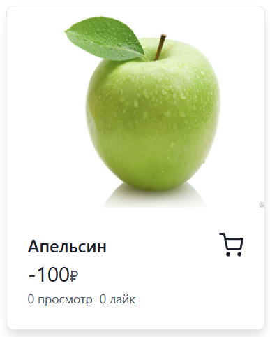

# Баг-репорты
## 1. Отсутствие валидации URL-ссылок изображений
| Заголовок             | Отсутствие валидации URL-ссылок изображений                                                                                                                                                  |
|:----------------------|:---------------------------------------------------------------------------------------------------------------------------------------------------------------------------------------------|
| Приоритет             | Высокий                                                                                                                                                                                      |
| Шаги воспроизведения  | 1. Открыть сайт http://tech-avito-intern.jumpingcrab.com 2. Нажать кнопку "Создать" 3. Ввести произвольные данные, а в поле URL изображения написать "url" 4. Нажать "Сохранить" |
| Ожидаемый результат   | Выходит ошибка, что URL невалидный                                                                                                                                                           |
| Фактический результат | Объявление создается, но при этом картинка не отображается из-за ссылки                                                                                                                      |
| Вложения              |                                                                                                                                        |
## 2. После создания объявления пользователь остается на главной странице
| Заголовок             | После создания объявления пользователь остается на главной странице                                                                                 |
|:----------------------|:----------------------------------------------------------------------------------------------------------------------------------------------------|
| Приоритет             | Средний                                                                                                                                             |
| Шаги воспроизведения  | 1. Открыть сайт http://tech-avito-intern.jumpingcrab.com 2. Нажать кнопку "Создать" 3. Ввести произвольные данные 4. Нажать "Сохранить" |
| Ожидаемый результат   | Пользователя перекидывает на страницу с созданным объявлением                                                                                       |
| Фактический результат | Пользователь остаётся на главной странице                                                                                                           |
## 3. При создании объявления можно поставить отрицательную стоимость
| Заголовок             | При создании объявления можно поставить отрицательную стоимость                                                                                                                    |
|:----------------------|:-----------------------------------------------------------------------------------------------------------------------------------------------------------------------------------|
| Приоритет             | Высокий                                                                                                                                                                            |
| Шаги воспроизведения  | 1. Открыть сайт http://tech-avito-intern.jumpingcrab.com 2. Нажать кнопку "Создать" 3. Ввести произвольные данные, а в поле "Цена" написать "-5" 4. Нажать "Сохранить" |
| Ожидаемый результат   | Выходит ошибка, что цена неправильно указана                                                                                                                                       |
| Фактический результат | Объявление успешно создается                                                                                                                                                       |
| Вложения              |                                                                                                                          |